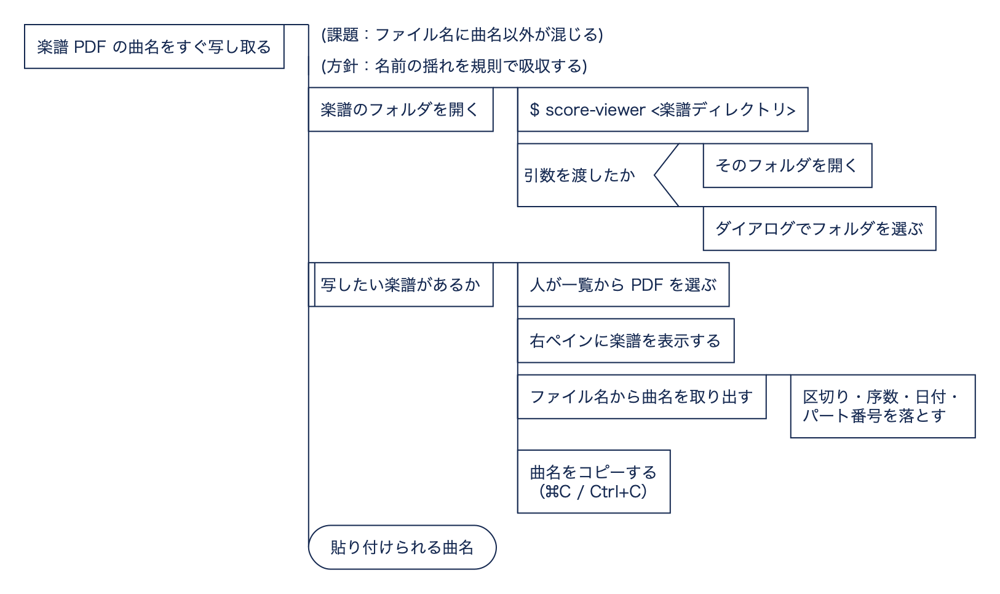

# score-viewer

楽譜PDFのフォルダを開き、左ペインの一覧からPDFをシングルクリックで右に表示。
ファイル名から曲名を抽出し、**⌘C / Ctrl+C** でクリップボードへコピーする軽量ビューア。

例: `112_Beethoven's 9th - 4th Horn in F -2024-11-08.pdf` → 曲名 `112_Beethoven's 9th`

PySide6 + QtPdf 製。区切り（`-` / `_` / 空白）、Horn 前後の序数、日付、`のコピー`、
`1,3` のようなパート番号の揺れを吸収して曲名だけを取り出す（曲名側の "9th" や
年 "2025" は保持する）。抽出規則は `src/score_viewer/naming.py`。

## 考え方

何が課題で、それをどう解いているかを PAD（問題分析図）で示します。各段の詳細は下の各節を参照してください。



<sub>図の元は [`docs/pad/concept.spd`](docs/pad/concept.spd)。[padkit](https://github.com/mashi727/padkit) で検査・描画しています。</sub>

## 導入・実行（uv）

CLI として使う（推奨。仮想環境は uv 管理・プロジェクト外）:

```bash
uv tool install --editable .        # score-viewer コマンドを導入（ソース編集が即反映）
score-viewer <楽譜ディレクトリ>       # 引数なしならフォルダ選択ダイアログ
```

開発時にそのまま動かす:

```bash
uv run score-viewer <楽譜ディレクトリ>
uv run pytest                        # 曲名抽出のテスト
```

## 使い方

左ペインは「現在フォルダの一覧」（ファイルマネージャ流）:

- 先頭に **`..`**（親フォルダ）、続いてサブフォルダ、PDF を表示（PDF 以外のファイルは非表示）
- **`..` / フォルダをダブルクリック** … そのフォルダへ移動
- **📂 / ⌘O** … 任意のフォルダを開く ／ **⌘↑** … 親フォルダへ
- **PDF をシングルクリック** … 右ペインに表示（複数ページ・幅フィット）
- **⌘C / Ctrl+C** … 選択中の曲名をコピー（曲名はタイトルバー・ステータスバーに表示）
- **自動更新** … 現在フォルダに PDF が追加/削除されると一覧へ即反映（`QFileSystemWatcher`。手動リロード不要。選択位置は維持）

## 端末から切り離して起動（任意）

`code` のように「& 無しで即プロンプトが戻る」起動にしたい場合、zsh 関数でラップする:

```zsh
score-viewer() { command score-viewer "$@" </dev/null &>/dev/null &! }
```
